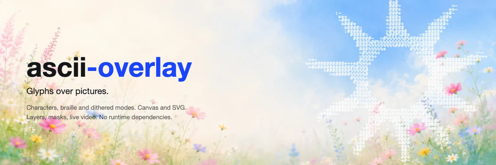
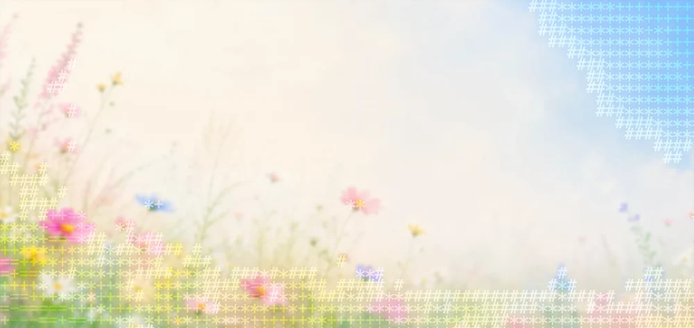
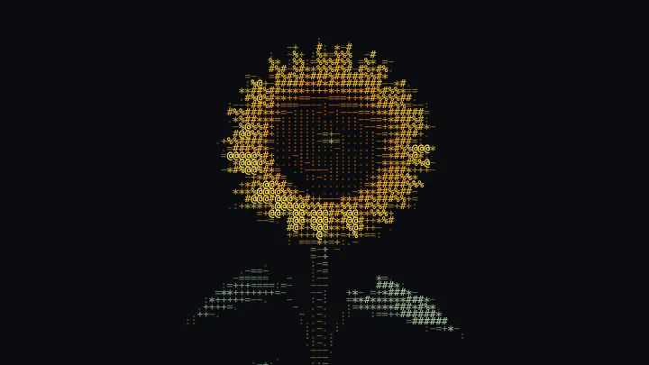

<p align="center">
  
</p>

<p align="center">
  Turn images and video into ASCII glyphs, then composite them over the picture.<br>
  Framework free core, separate React entry, no runtime dependencies.
</p>

```bash
npm i ascii-overlay
```

## What it does

Most ASCII converters stop at the text. This one keeps going: `renderAscii` reduces pixels to a grid of glyphs, and a layer compositor stacks that grid over fills, images and other grids, each layer with its own blend, opacity and filter. Sharp glyphs over a blurred photo, characters inside an ellipse, a dither texture screened under a character layer.

Three modes: character ramps, unicode braille at 2x4 dots per cell, and Floyd-Steinberg dither. Two backends: canvas for speed, SVG for glyphs that stay sharp at any zoom. The same `Grid` feeds both.

<p align="center">
  
</p>

<p align="center">
  <sub>the photograph is the backdrop, glyphs cover one region, and a <code>mask</code> predicate draws the edge</sub>
</p>

The banner above was made with the library. The sun's silhouette is a mask predicate and the wobble comes from `sampleOffset`; the source is in [`assets/banner.js`](assets/banner.js).

## Quick start

`Source` has the same shape as `ImageData`, so a canvas context hands you one directly.

```ts
import { measureCell, renderAscii, drawToCanvas } from 'ascii-overlay';

const source = ctx.getImageData(0, 0, canvas.width, canvas.height);
const cell = measureCell(ctx, 11);                 // { cellWidth: 6.6, cellHeight: 8 }

const grid = renderAscii(source, { mode: 'characters', ...cell });
drawToCanvas(out, grid, { fontSize: 11, background: '#000' });
```

In React:

```tsx
import { measureCell } from 'ascii-overlay';
import { AsciiCanvas } from 'ascii-overlay/react';

<AsciiCanvas source={imageData} mode="characters" {...cell} fontSize={11} background="#000" />
```

`AsciiText` renders the same grid into a `<pre>` you can select and copy. `AsciiSvg` renders it as vector text.

## Video

<p align="center">
  
</p>

Left half rendered, right half untouched, split by a `mask` predicate on the column index.

`useVideoSource` samples frames from a `<video>` and hands back a `Source` on every animation frame.

```tsx
import { useVideoSource } from 'ascii-overlay/react';

const video = useRef<HTMLVideoElement>(null);
const source = useVideoSource(video, { maxWidth: 900 });

return (
  <>
    <video ref={video} src="clip.mp4" autoPlay muted loop playsInline hidden />
    {source && <AsciiCanvas source={source} mode="characters" {...cell} fontSize={11} />}
  </>
);
```

A 900x506 colour frame costs 6.03ms end to end, or 2.60ms with a flat glyph colour, so both fit a 60fps budget. The hook owns its scratch canvas so it can set `willReadFrequently`, without which `getImageData` alone doubles from 2.56ms to 5.21ms per frame.

Do not use the SVG backend for video. Parsing 8,704 text nodes into the DOM costs 15.9ms per frame on its own.

## Layers

`AsciiCanvas` and `AsciiSvg` draw one grid. For anything else, build the stack yourself.

```ts
import { fillLayer, imageLayer, asciiLayer, paintLayers, layersToSvg } from 'ascii-overlay';

const stack = [
  fillLayer('#05070c'),
  imageLayer(photo, { blur: 14, opacity: 0.55 }),
  asciiLayer(ditherGrid, { fontSize: 5, color: '#1d3b57', opacity: 0.8 }),
  asciiLayer(charGrid, { fontSize: 11, blend: 'screen', filter: 'url(#glow)' }),
];

paintLayers(ctx, stack);
layersToSvg(stack, { width, height, defs });
```

`blend`, `opacity` and `filter` belong to every layer, so an ASCII layer can be blurred or faded like an image. `drawToCanvas` is a wrapper that builds a three layer stack out of `background`, `backdrop` and the glyphs.

Only fill, image and ascii layers ship. `Layer` is public, so anything with `paintCanvas` and `toSvgMarkup` joins the same stack:

```ts
const scanlines = {
  opacity: 0.25,
  paintCanvas(ctx, { width, height }) {
    ctx.fillStyle = '#fff';
    for (let y = 0; y < height; y += 4) ctx.fillRect(0, y, width, 1);
  },
  toSvgMarkup: ({ width, height }) => `<rect width="${width}" height="${height}" .../>`,
};
```

## Effects

The renderer knows nothing about specific effects. It exposes three seams and the effect stays in your code.

| Seam | Stage | What moves |
|---|---|---|
| `(Source) => Source` | pixels | anything, before the grid exists |
| `sampleOffset` | sampling | the picture shifts under the grid, so glyphs change |
| `offset` | painting | the glyph moves, its choice does not |

Squigglevision through `sampleOffset` makes the image itself shake:

```ts
const wobble = (frame: number, amp: number) => (col: number, row: number) => {
  const h = Math.imul((col * 73856093) ^ (row * 19349663) ^ (frame * 83492791), 0x2545f491);
  return { x: ((h & 0xff) / 255 - 0.5) * 2 * amp,
           y: (((h >>> 8) & 0xff) / 255 - 0.5) * 2 * amp };
};

renderAscii(source, { mode: 'characters', ...cell, sampleOffset: wobble(frame, 1.5) });
```

Hold each wobble for a beat rather than redrawing it every frame. `Math.floor(time * 8)` gives the eight per second that reads as squigglevision instead of noise.

How much a displacement shows depends on the picture. Averaging over a cell is a low pass filter, so a gradient barely reacts while a detailed frame changes a fifth of its glyphs from a single pixel of shift:

| Displacement | Smooth gradient | Detailed source |
|---|---|---|
| 1px | 0.5% | 19.5% |
| 2px | 0.9% | 30.3% |
| 8px | 3.2% | 51.7% |

### SVG filters

Filters hang on a layer. Declare them in `defs` and reference them by id.

```ts
layersToSvg(stack, {
  width, height,
  defs: '<filter id="glow"><feGaussianBlur stdDeviation="2" result="b"/>'
      + '<feMerge><feMergeNode in="b"/><feMergeNode in="SourceGraphic"/></feMerge></filter>',
});
```

The canvas backend only has `ctx.filter`, which takes CSS filter functions. For `feTurbulence`, `feColorMatrix` or a custom convolution, use SVG.

## API

### renderAscii(source, options)

Reduces a `Source` to a `Grid` of cells, each with a glyph, a mean colour and a position.

| Option | Meaning |
|---|---|
| `mode` | `characters`, `braille` or `dither` |
| `cellWidth`, `cellHeight` | cell footprint in source pixels, fractional is fine |
| `ramp` | a name from `RAMPS` or a literal, ordered dark to bright |
| `invert` | reverse the ramp |
| `tone` | `{ contrast, brightness, gamma }` applied to cell luminance |
| `edgeEmphasis` | 0..1, at 1 glyphs follow Sobel edges instead of brightness |
| `darkThreshold` | 0..1, cells dimmer than this go blank |
| `coverage`, `coverageSeed` | 0..1 fraction of cells to keep, thinned by hash |
| `grade` | `{ preset, saturation, tint }` applied to cell colour |
| `mask` | `(col, row, luminance) => boolean`, false leaves the cell blank |
| `animation` | `{ time, shimmer, speed, seed }`, wobbles the glyph index |
| `threshold` | 0..1 cut-off for braille dots and dither cells |
| `sampleOffset` | `(col, row) => { x, y }`, moves where the cell reads |

Grade presets: `none`, `bw`, `sepia`, `warm`, `cool`, `vintage`, `fade`, `cyber`. Ramps: `minimal`, `standard`, `detailed`, `blocks`.

`mask` gets the cell's luminance after `tone` and `edgeEmphasis`, so brightness is a selection criterion and not only position. `darkThreshold` keeps the bright end; a predicate keeps either end, or a band, or a shape and a band together.

```ts
mask: (col, row, lum) => lum < 0.9                       // skip the brightest cells
mask: (col, row, lum) => lum > 0.55 && lum < 0.85        // a band
mask: (col, row, lum) => col < 40 && lum > 0.6           // and a shape
```

Check the distribution before picking numbers. A pale photograph can have nothing below 0.6 at all, and asking for the dark end then returns an empty frame that looks like a bug. `assets/tuner.html` plots it.

### asciiLayer(grid, options)

| Option | Meaning |
|---|---|
| `fontSize`, `fontFamily` | glyph size and face |
| `color` | one colour for every glyph instead of its cell colour |
| `cellWidth`, `cellHeight` | needed by the SVG backend to pin run widths |
| `cellBackground` | a colour, or `(cell) => string \| null`, filled behind each cell |
| `fillBlankCells` | default true, false punches holes where there is no glyph |
| `snapCellBackground` | default true, rounds fill rects to whole pixels |
| `offset` | `(cell) => { x, y }`, displaces the glyph from its cell |
| `blend`, `opacity`, `filter` | composition, shared by every layer type |

### drawToCanvas(ctx, grid, options)

Takes everything `asciiLayer` does, plus `background`, `backdrop` (`{ image, blur, opacity }`), `pixelRatio` and `clear`. Pass `clear: false` to stack several calls onto one surface.

### measureCell(ctx, fontSize, options)

Returns `{ cellWidth, cellHeight }` for a font. `sample` picks the glyph to measure and defaults to `M`; `ramp` measures the whole ramp and takes the mean ink; `lineHeight` scales the result; `fontFamily` selects the face.

### React

| Export | Purpose |
|---|---|
| `AsciiCanvas` | draws a grid on a canvas, forwards a ref to the element |
| `AsciiSvg` | draws it as vector text |
| `AsciiText` | renders it into a `<pre>` |
| `useAsciiGrid` | memoised `renderAscii`, options compared by value |
| `useVideoSource` | samples `<video>` frames into a `Source` |
| `useAnimationTime` | elapsed seconds from `requestAnimationFrame` |

Callbacks like `mask` and `sampleOffset` are compared by identity, since `JSON.stringify` cannot see them. A fresh closure each frame rebuilds each frame, which is what an animation wants; memoise anything static.

## Things that will bite you

Cell height comes from the glyph's ink, not the font size. At 11px monospace the advance is 6.6px but `M` inks about 8px tall, so passing the font size as the cell height leaves a blank band under every row and the art reads as stripes. `measureCell` reports both. Ink height also varies by glyph, from 5.7px for `+` to 9.3px for `@`, so no single height suits all of them; `M` sits in the middle and `lineHeight` tunes it.

Luminance is Rec. 709, so pure blue nearly disappears. Its weight is 0.0722.

Proportional fonts do not fit a fixed grid. The canvas backend checks whether the face is monospaced and falls back to placing each glyph itself, which is slower but aligned. SVG cannot measure a font while generating markup, so it pins run widths with `textLength` and intra-run glyphs will not sit exactly on cell boundaries.

Thinning and shimmer are hashed rather than random. A random draw would repick every frame and the art would crawl.

Cell backgrounds round to whole pixels by default. Cells step a fractional distance, so an exact rect ends mid pixel and the next begins there; neither covers it fully and source-over will not add two partial coverages back to opaque. Over an opaque backdrop nobody notices, but on a transparent canvas 11.6% of the frame comes out translucent. Set `snapCellBackground: false` if you would rather keep the exact geometry.

## Development

```bash
npm run sample       # generate the demo image, no dependencies
npm run build        # dist/
npm test             # 317 tests
npm run typecheck
```

`playground/` is a React app with a control for every option, plus clipboard paste, webcam and video input. `demo/` renders every option into one contact sheet.

```bash
npx vite playground              # http://127.0.0.1:5180
python3 -m http.server 8901      # http://127.0.0.1:8901/demo/
```

Squigglevision and the mask shapes live in `playground/App.tsx`, not in the library. They are a dozen lines each against the seams above.

## Known limits

Braille uses a hard threshold, so midtones collapse and `threshold` needs tuning per image. Dot level error diffusion would fix it.

`edgeEmphasis` runs at cell resolution and does not reach braille's dot grid.

Colour SVG is heavy: distinct per cell colours stop runs merging, so 8,704 cells become 7,225 `<text>` nodes and about 880kB. A flat `color` collapses the same frame to 97 runs.

## License

MIT
